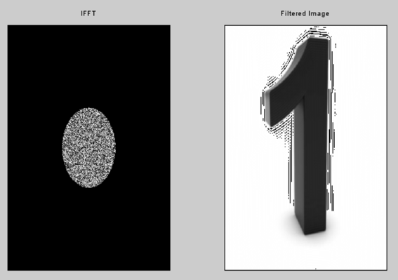

# Frequency Domain Filtering

### Input Image with FFT & FFT Shift:

## Ideal Low Pass Filter:
### IFFT & Filtered Image:

## Guassian Filter:
### IFFT & Filtered Image:

## Butterworth Low Pass Filter:
### IFFT & Filtered Image (n = 1):

### IFFT & Filtered Image (n = 2):

